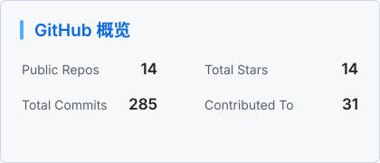
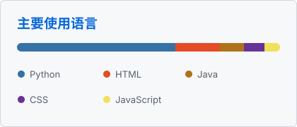

<!-- Typing intro -->

  

  
  
<strong>关于我</strong>

  

    安徽师范大学在读，这里是工一阵。 
    之前是CTF选手，现在在学 <strong>AI Agent 开发</strong>，从对话、工具调用到记忆与任务编排，一边学习，一边构建。 
    同时也是 <strong>VOCALOID</strong> 重度爱好者。 
    希望在这里记录成长，也认识更多愿意认真做事的朋友。
  

   

<strong>目前关注</strong>

<table align="center">
  <thead>
    <tr>
      <th>方向</th>
      <th>正在探索</th>
    </tr>
  </thead>
  <tbody>
    <tr>
      <td>Agent Architecture</td>
      <td>理解 Agent 的状态、循环与执行边界</td>
    </tr>
    <tr>
      <td>Tool Use &amp; Skills</td>
      <td>让模型稳定地发现、选择并调用工具</td>
    </tr>
    <tr>
      <td>Context &amp; Memory</td>
      <td>尝试可控的上下文、记忆与检索机制</td>
    </tr>
    <tr>
      <td>Blackboard Architecture</td>
      <td>探索多 Agent 协作中的共享状态、异步执行与结果汇聚</td>
    </tr>
  </tbody>
</table>

 

  
  
  
  
  

  
  
  
  
  

 

  
  

  

